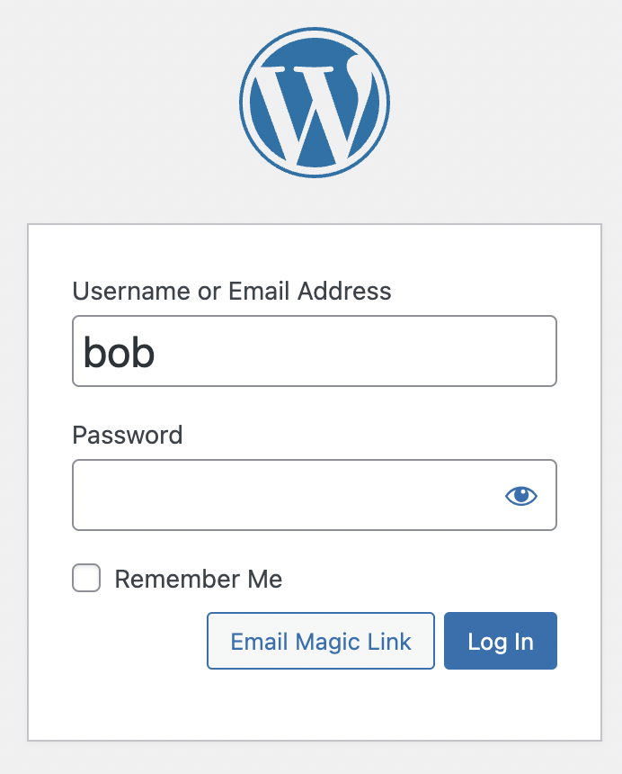
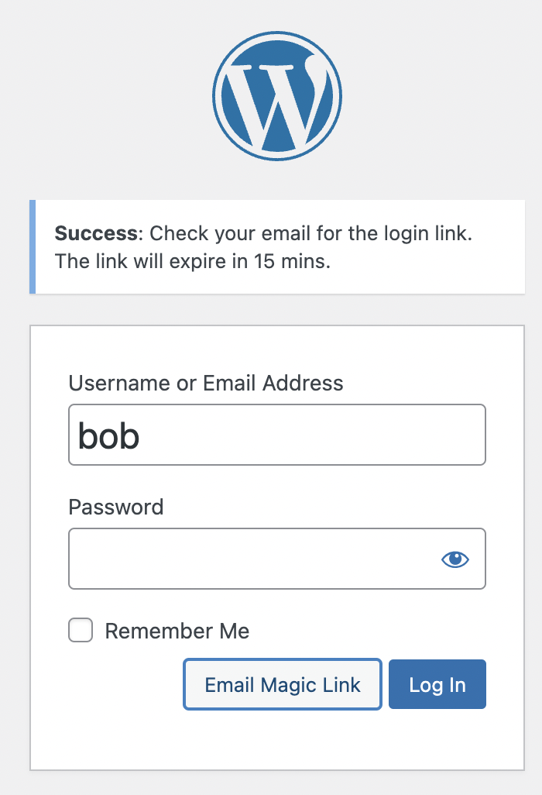
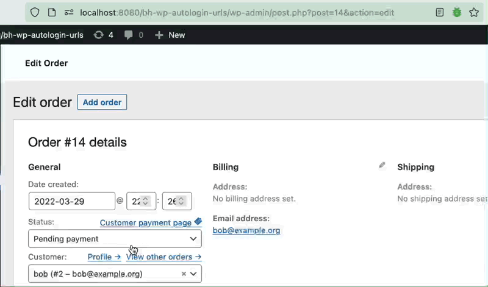

[](https://wordpress.org/plugins/bh-wp-autologin-urls) [](https://github.com/WordPress-Coding-Standards/WordPress-Coding-Standards) [](https://brianhenryie.github.io/bh-wp-autologin-urls/) [](https://github.com/szepeviktor/phpstan-wordpress) [](https://wordpress.org/plugins/bh-wp-autologin-urls/advanced/)

# Autologin URLs

Adds single-use passwords to WordPress emails' URLs for frictionless login, and magic-link emails for passwordless login. 

## Overview

This plugin hooks into the `wp_mail` filter to augment existing URLs with login codes so users are automatically logged in when visiting the site through email links.

It is in use for a charity whose annual requests for donations to non-tech-savvy users was resulting in users unable to remember their password. Now those users are instantly logged in.

It should also help solve the problem with WooCommerce abandoned cart emails where the user must be logged in to know _who_ abandoned the cart.

Also useful for logging users back in when they get reply notifications for their comments, bbPress posts etc.



Example email sent via [Comment Reply Email Notification](https://wordpress.org/plugins/comment-reply-email-notification/) plugin.

This plugin makes minor theme/user-facing changes on login forms. An additional "Email Magic Link" button is added which sends an email containing with an autologin URL to instantly log in users. This applies to wp-login.php and to WooCommerce login forms.



## Installation & Configuration

Install `Autologin URLs` from [the WordPress plugin directory](https://wordpress.org/plugins/bh-wp-autologin-urls).

There is no configuration needed. By default:

* Codes expire after seven days
* Emails to admins do not get autologin codes added
* Some emails are filtered out by subject using regex

The settings page can be found in the admin UI under `Settings`/`Autologin URLs`, as a link on the Plugins page, or at `/wp-admin/options-general.php?page=bh-wp-autologin-urls`.


## Operation

* Hooked on `wp_mail`
* Login code consists of user id and random alphanumeric password separated by `~`
* Stored in a WordPress database table, hashed so no relationship between each code and any user can be determined
* Deleted after a single use

Links take the form: `https://brianhenry.ie/?autologin=582~Yxu1UQG8IwJO`

Logs to see the frequency of its usefulness are available at: `wp-admin/admin.php?page=bh-wp-autologin-urls-logs`

WooCommerce's "Customer Payment Page" link has been changed to include an autologin code and to copy to clipboard when clicked (to avoid logging out shop managers).



### Secure

The plugin conforms to all the suggestions in the StackExchange discussion, [Implementing an autologin link in an email](https://security.stackexchange.com/questions/129846/implementing-an-autologin-link-in-an-email):

* Cryptographically Secure PseudoRandom Number Generation (via [wp_rand](https://core.trac.wordpress.org/ticket/28633))
* Stored as SHA-256 hash
* Codes are single use
* Codes automatically expire

Additionally, authentication via Autologin URLs is disabled for 24 hours for users whose accounts have had five failed login attempts through an autologin URL and for IPs which have attempted and failed five times.

**Warning:** 

> *If you use any plugin to save copies of outgoing mail, those saved emails will contain autologin URLs.*

**Warning:**

> *If a user forwards the email to their friend, the autologin links may still work.* The autologin codes only expire if used to log the user in, i.e. if the user is already logged in, the code is never used/validated/expired, so continues to work until its expiry time. This behaviour was a performance choice (but could be revisited via AJAX and not affect page load time). 

### Performant

* Additional database queries only occur when a URL with `autologin=` is visited
* No database queries (beyond autoloaded settings) are performed if the autologin user is already logged in
* A nightly cron job deletes expired autologin codes

## API

Two filters are added to expose the main functionality to developers of other plugins (which don't use `wp_mail()`), e.g. for push notifications:

```
$url = apply_filters( 'add_autologin_to_url', $url, $user );
```
```
$message = apply_filters( 'add_autologin_to_message', $message, $user );
```

Filters to configure the expiry time, admin enabled setting and subject exclusion regex list are defined in the `BrianHenryIE\WP_Autologin_URLs\WP_Includes\WP_Mail` class.

[API functions](https://github.com/BrianHenryIE/BH-WP-Autologin-URLs/blob/master/src/api/interface-api.php) can be accessed through plugin's global:

```
/** @var BrianHenryIE\WP_Autologin_URLs\API\API $autologin_urls */
$autologin_urls = $GLOBALS['bh-wp-autologin-urls'];
```

## TODO

* Regex for URLs with trailing brackets e.g. "(https://example.org)" 
* Remove the autologin URL parameter in the browser location bar on success
* Verify i18n is applied everywhere __()
* Delete all passwords button in admin UI
* Regex subject filters should be verified with `preg_match()` before saving
* Error messages on settings page validation failures
* Sanitize out regex pattern that would entirely disable the plugin
* Client-side settings page validation
* Test adding an autologin code to a URL which already has one overwrites the old one (and leaves only the one).
* ~~The Newsletter Plugin integration~~ – and any plugin that doesn't use wp_mail
* ~~Magic link button on wp-login.php~~
* Use:
      `$wp_hasher = new PasswordHash( 8, true );`
      `$hashed = $wp_hasher->HashPassword( $password );`
* Add "send magic link" to wp-admin/user.php for admin use.

## Licence

GPLv2 or later.