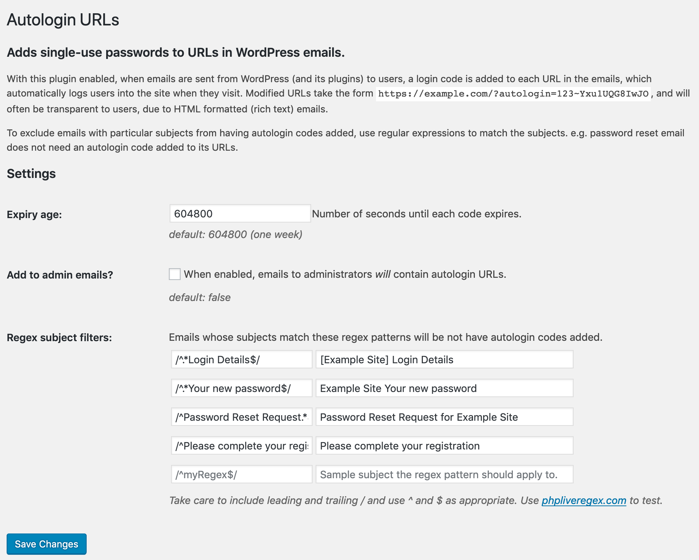

[](https://wordpress.org/plugins/bh-wp-autologin-urls) [](https://github.com/WordPress-Coding-Standards/WordPress-Coding-Standards) [](https://brianhenryie.github.io/bh-wp-autologin-urls/) [](https://wordpress.org/plugins/bh-wp-autologin-urls/advanced/)

# Autologin URLs

Adds single-use passwords to WordPress emails' URLs for frictionless login.

## Overview

This plugin hooks into the `wp_mail` filter to augment existing URLs with login codes so users are automatically logged in when visiting the site through email links.

It is in use for a charity whose annual requests for donations to non-tech-savvy users was resulting in users unable to remember their password. Now those users are instantly logged in.

It should also help solve the problem with WooCommerce abandoned cart emails where the user must be logged in to know _who_ abandoned the cart.

Also useful for logging users back in when they get reply notifications for their comments, bbPress posts etc.

This plugin makes no theme/user-facing changes.


Example email sent via [Comment Reply Email Notification](https://wordpress.org/plugins/comment-reply-email-notification/) plugin.

## Installation & Configuration

Install `Autologin URLs` from [the WordPress plugin directory](https://wordpress.org/plugins/bh-wp-autologin-urls).

There is no configuration needed. By default:

* Codes expire after seven days
* Emails to admins do not get autologin codes added
* Some emails are filtered out by subject using regex

The settings page can be found in the admin UI under `Settings`/`Autologin URLs`, as a link on the Plugins page, or at `/wp-admin/options-general.php?page=bh-wp-autologin-urls`.



## Operation

* Hooked on `wp_mail`
* Login code consists of user id and random alphanumeric password separated by `~`
* Stored in WordPress database hashed as a transient with an expiration time
* Deleted after a single use

Links take the form: `https://brianhenry.ie/?autologin=582~Yxu1UQG8IwJO`

### Secure

The plugin conforms to all the suggestions in the StackExchange discussion, [Implementing an autologin link in an email](https://security.stackexchange.com/questions/129846/implementing-an-autologin-link-in-an-email):

* Cryptographically Secure PseudoRandom Number Generation (via [wp_rand](https://core.trac.wordpress.org/ticket/28633))
* Stored as SHA-256 hash
* Codes are single use
* Codes automatically expire

Additionally, authentication via Autologin URLs is disabled for 24 hours for users whose accounts have had five failed login attempts through an autologin URL and for IPs which have attempted and failed five times.

**Warning:** *If you use any plugin to save copies of outgoing mail, those saved emails will contain autologin URLs.*

**Warning:** *If a user forwards the email to their friend, the autologin links may still work.* The autologin codes only expire if used to log the user in, i.e. if the user is already logged in, the code is never used/validated/expired, so continues to work until its expiry time. This behaviour was a performance choice (but could be revisited via AJAX and not affect page load time). 

### Performant

* The additional rows added as transients to the `wp_options` table will be proportionate to the number of emails sent
* Additional database queries only occur when a URL with `autologin=` is visited
* No database queries (beyond autoloaded settings) are performed if the autologin user is already logged in
* Transients are queried by `wp_options.option_name` which is a [UNIQUE](http://www.mysqltutorial.org/mysql-unique-constraint/) column, i.e. indexed
* Transients are deleted when they are used to login
* WordPress, [since v4.9](https://core.trac.wordpress.org/ticket/41699#comment:17), automatically purges expired transients

### Tested

PHPUnit has been run with WordPress 5.3 on PHP 7.1 to 98% coverage.

## API

Two filters are added to expose the main functionality to developers of other plugins (which don't use `wp_mail()`), e.g. for push notifications:

```
$url = apply_filters( 'add_autologin_to_url', $url, $user );
```
```
$message = apply_filters( 'add_autologin_to_message', $message, $user );
```

Filters to configure the expiry time, admin enabled setting and subject exclusion regex list are defined in the `BH_WP_Autologin_URLs\wp_mail\WP_Mail` class.

Instances of classes hooked in actions and filters are exposed as properties of `BH_WP_Autologin_URLs` class, accessible with:

```
/** @var BH_WP_Autologin_URLs\includes\BH_WP_Autologin_URLs $autologin_urls */
$autologin_urls = $GLOBALS['bh-wp-autologin-urls'];
```

[API functions](https://github.com/BrianHenryIE/BH-WP-Autologin-URLs/blob/master/src/api/interface-api.php) can be accessed through the `api` property of the main plugin class:

```
/** @var BH_WP_Autologin_URLs\api\API_Interface $autologin_urls_api */
$autologin_urls_api = $GLOBALS['bh-wp-autologin-urls']->api;
```
## Contributing

Clone this repo, open PhpStorm, then run `composer install` to install the dependencies.

```
git clone https://github.com/brianhenryie/bh-wp-autologin-urls.git;
open -a PhpStorm ./;
composer install;
```

For integration and acceptance tests, a local webserver must be running with `localhost:8080/bh-wp-autologin-urls/` pointing at the root of the repo. MySQL must also be running locally – with two databases set up with:

```
mysql_username="root"
mysql_password="secret"

# export PATH=${PATH}:/usr/local/mysql/bin

# Make .env available 
# To bash:
# export $(grep -v '^#' .env.testing | xargs)
# To zsh:
# source .env.testing

# Create the database user:
# MySQL
# mysql -u $mysql_username -p$mysql_password -e "CREATE USER '"$TEST_DB_USER"'@'%' IDENTIFIED WITH mysql_native_password BY '"$TEST_DB_PASSWORD"';";
# or MariaDB
# mysql -u $mysql_username -p$mysql_password -e "CREATE USER '"$TEST_DB_USER"'@'%' IDENTIFIED BY '"$TEST_DB_PASSWORD"';";

# Create the databases:
mysql -u $mysql_username -p$mysql_password -e "CREATE DATABASE "$TEST_SITE_DB_NAME"; USE "$TEST_SITE_DB_NAME"; GRANT ALL PRIVILEGES ON "$TEST_SITE_DB_NAME".* TO '"$TEST_DB_USER"'@'%';";
mysql -u $mysql_username -p$mysql_password -e "CREATE DATABASE "$TEST_DB_NAME"; USE "$TEST_DB_NAME"; GRANT ALL PRIVILEGES ON "$TEST_DB_NAME".* TO '"$TEST_DB_USER"'@'%';";
```

### WordPress Coding Standards

See documentation on [WordPress.org](https://make.wordpress.org/core/handbook/best-practices/coding-standards/) and [GitHub.com](https://github.com/WordPress/WordPress-Coding-Standards).

Correct errors where possible and list the remaining with:

```
vendor/bin/phpcbf; vendor/bin/phpcs
```

### Tests

Tests use the [Codeception](https://codeception.com/) add-on [WP-Browser](https://github.com/lucatume/wp-browser) and include vanilla PHPUnit tests with [WP_Mock](https://github.com/10up/wp_mock).

Run tests with:

```
vendor/bin/codecept run unit;
vendor/bin/codecept run wpunit;
vendor/bin/codecept run integration;
vendor/bin/codecept run acceptance;
```

Show code coverage (unit+wpunit):

```
XDEBUG_MODE=coverage composer run-script coverage-tests 
```

```
vendor/bin/phpstan analyse --memory-limit 1G
```

To save changes made to the acceptance database:

```
export $(grep -v '^#' .env.testing | xargs)
mysqldump -u $TEST_SITE_DB_USER -p$TEST_SITE_DB_PASSWORD $TEST_SITE_DB_NAME > tests/_data/dump.sql
```

To clear Codeception cache after moving/removing test files:

```
vendor/bin/codecept clean
```

### More Information

See [github.com/BrianHenryIE/WordPress-Plugin-Boilerplate](https://github.com/BrianHenryIE/WordPress-Plugin-Boilerplate) for initial setup rationale. 


### Minimum PHP Version

[PHPCompatibilityWP](https://github.com/PHPCompatibility/PHPCompatibilityWP) is installed by Composer to check the minimum PHP version required. 

```
./vendor/bin/phpcs -p ./src --standard=PHPCompatibilityWP --runtime-set testVersion 5.7-
```

### Minimum WordPress Version

The minimum WordPress version was determined using [wpseek.com's Plugin Doctor](https://wpseek.com/pluginfilecheck/).

### WordPress.org Deployment

https://zerowp.com/use-github-actions-to-publish-wordpress-plugins-on-wp-org-repository/

https://github.com/marketplace/actions/composer-php-actions

## TODO

* Regex for URLs with trailing brackets e.g. "(https://example.org)" 
* Remove the autologin URL parameter in the browser location bar on success
* Verify i18n is applied everywhere __()
* Delete all passwords button in admin UI
* Regex subject filters should be verified with `preg_match()` before saving
* Error messages on settings page validation failures
* Sanitize out regex pattern that would entirely disable the plugin
* Client-side settings page validation
* Test adding an autologin code to a URL which already has one overwrites the old one (and leaves only the one).
* The Newsletter Plugin integration – and any plugin that doesn't use wp_mail
 
## Licence

GPLv2 or later.